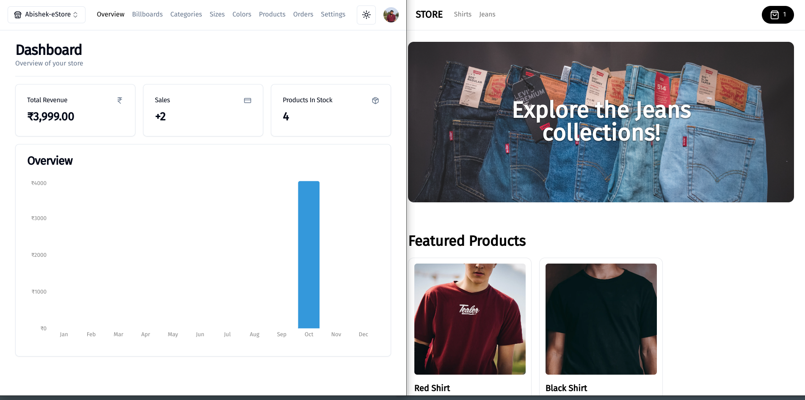
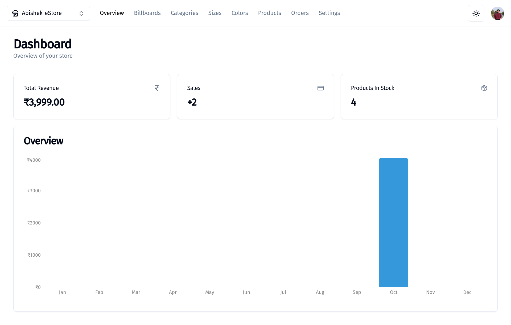
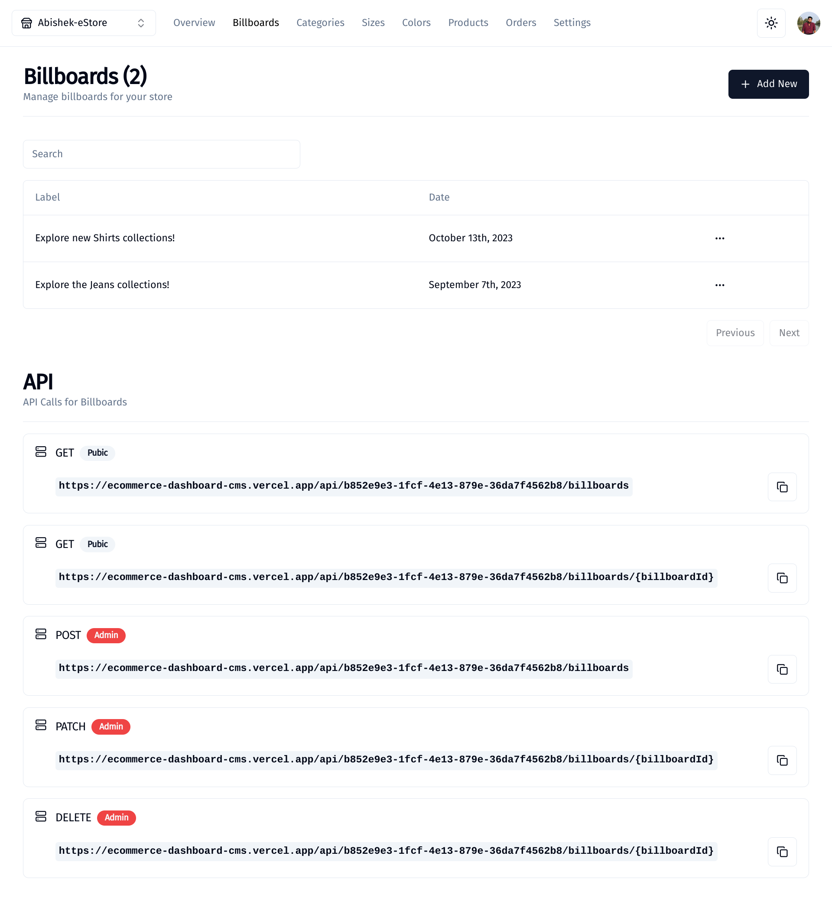
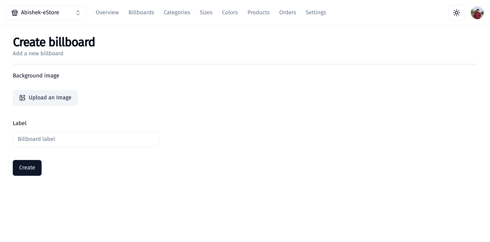
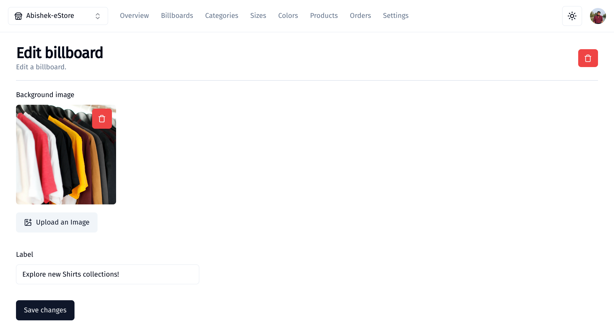
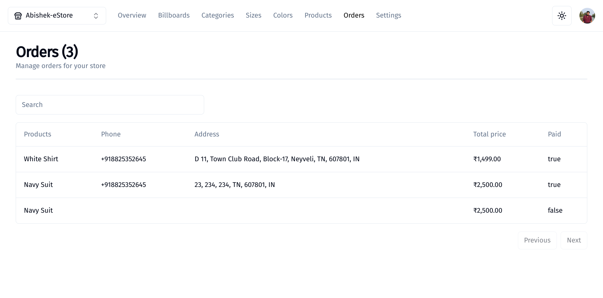
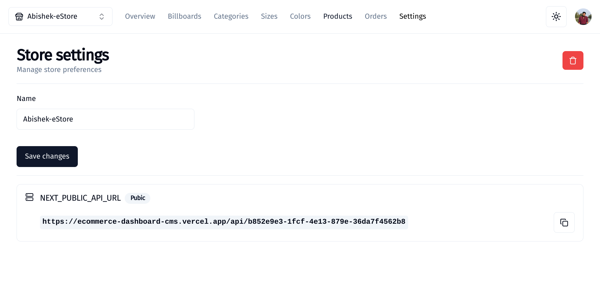

# Dashboard and CMS Live app - https://ecommerce-dashboard-cms.vercel.app/

# Store Live page - https://ecommerce-store-theta-gray.vercel.app/



# Full Stack E-Commerce + Dashboard & CMS Project

## Technologies used: Next.js 13, React, Tailwind, Prisma, MySQL, Stripe

### Key Features:

-   I utilize Shadcn UI for the administration interface.
-   The admin dashboard serves as a versatile system for CMS, admin functions, and API operations.
-   Multiple vendors and stores are efficiently managed through this centralized CMS, with automated API route generation for each.
-   Comprehensive management of categories, products, filters, and image updates is handled seamlessly.
-   Administration includes overseeing "Billboards" and their associations with categories or standalone displays.
-   Implementation of a robust search functionality across various aspects, complete with pagination features.
-   Oversight of featured products on the homepage, order management, and sales monitoring with revenue tracking through graphical representation.
-   Authentication is managed using Clerk.
-   Order creation is streamlined, integrating Stripe checkout and webhooks for efficient processing.
-   Database setup is established using MySQL, Prisma, and PlanetScale for optimal performance and reliability.

### Prerequisites

**Node version 14.x**

### Cloning the repository

```shell
git clone https://github.com/abishek-as/ecommerce-dashboard-cms.git
```

### Install packages

```shell
npm i
```

### Setup .env file

```js
NEXT_PUBLIC_CLERK_PUBLISHABLE_KEY=
CLERK_SECRET_KEY=
NEXT_PUBLIC_CLERK_SIGN_IN_URL=/sign-in
NEXT_PUBLIC_CLERK_SIGN_UP_URL=/sign-up
NEXT_PUBLIC_CLERK_AFTER_SIGN_IN_URL=/
NEXT_PUBLIC_CLERK_AFTER_SIGN_UP_URL=/
DATABASE_URL=''
NEXT_PUBLIC_CLOUDINARY_CLOUD_NAME=""
STRIPE_API_KEY=
FRONTEND_STORE_URL=http://localhost:3001
STRIPE_WEBHOOK_SECRET=
```

### Connect to PlanetScale and Push Prisma

```shell
npx prisma generate
npx prisma db push
```

### Start the app

```shell
npm run dev
```

## Available commands

Running commands with npm `npm run [command]`

| command | description                              |
| :------ | :--------------------------------------- |
| `dev`   | Starts a development instance of the app |

## Images

### Dashboard



### Billboard Settings



### Create Billboard



### Edit Billboard



### Orders



### Store settings


